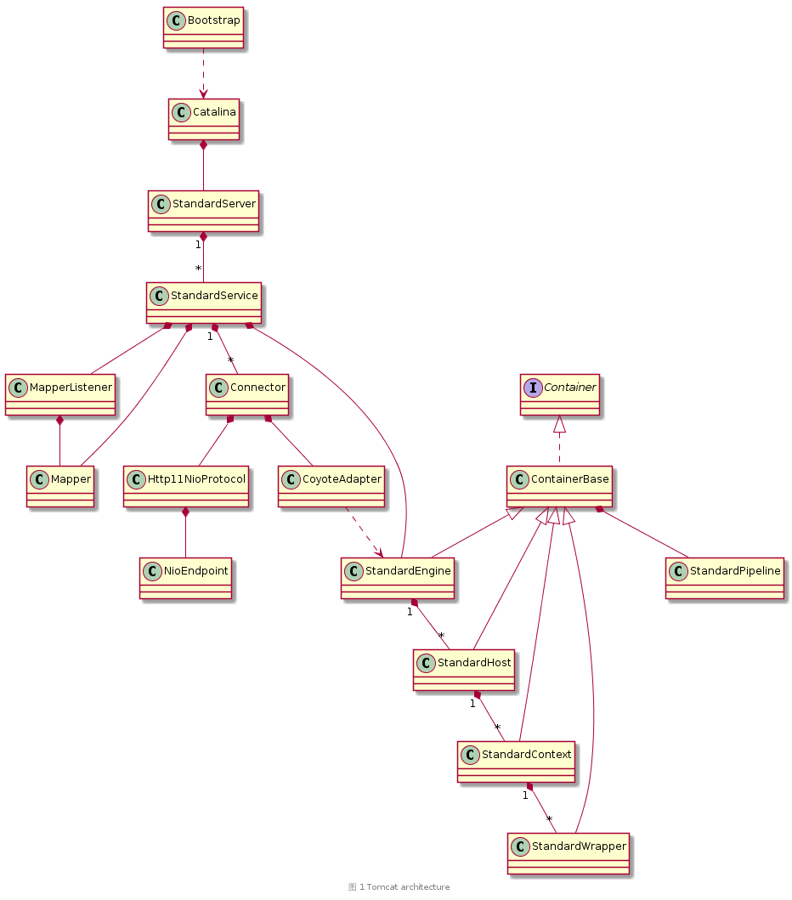
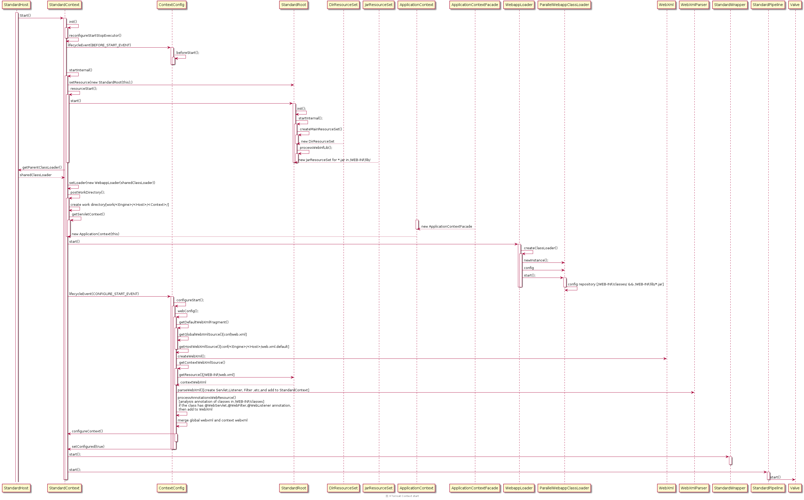
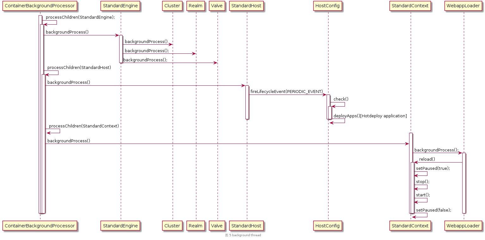

# 谈谈 Tomcat 架构及启动过程[含部署]

这个题目命的其实是很大的，写的时候还是很忐忑的，但我尽可能把这个过程描述清楚。因为这是读过源码以后写的总结，在写的过程中可能会忽略一些前提条件，如果有哪些比较突兀就出现，或不好理解的地方可以给我提 Issue，我会尽快补充修订相关内容。

很多东西在时序图中体现的已经非常清楚了，没有必要再一步一步的作介绍，所以本文以图为主，然后对部分内容加以简单解释。

- 绘制图形使用的工具是 [PlantUML](http://plantuml.com/) + [Visual Studio Code](https://code.visualstudio.com/) + [PlantUML Extension](https://marketplace.visualstudio.com/items?itemName=jebbs.plantuml)
- 图形 `PlantUML` 源文件：
    1. [tomcat-architecture.pu](../pics/tomcat-architecture.pu)
    1. [tomcat-init.pu](../pics/tomcat-init.pu)
    1. [tomcat-start.pu](../pics/start.pu)
    1. [tomcat-context-start.pu](../pics/tomcat-context-start.pu)
    1. [tomcat-background-thread.pu](../pics/tomcat-background-thread.pu)

本文对 Tomcat 的介绍以 `Tomcat-9.0.0.M22` 为标准。

`Tomcat-9.0.0.M22` 是 Tomcat 目前最新的版本，但尚未发布，它实现了 `Servlet4.0` 及 `JSP2.3` 并提供了很多新特性，需要 1.8 及以上的 JDK 支持等等，详情请查阅 [Tomcat-9.0-doc](https://tomcat.apache.org/tomcat-9.0-doc/index.html)

<!-- TOC -->

- [Overview](#overview)
- [Tomcat init](#tomcat-init)
- [Tomcat Start[Deployment]](#tomcat-startdeployment)
    - [Context Start](#context-start)
- [Background process](#background-process)
- [How to read excellent open source projects](#how-to-read-excellent-open-source-projects)
- [At last](#at-last)
- [Reference](#reference)

<!-- /TOC -->

---

## Overview

1. `Bootstrap` 作为 Tomcat 对外界的启动类,在 `$CATALINA_BASE/bin` 目录下，它通过反射创建 `Catalina` 的实例并对其进行初始化及启动。
1. `Catalina` 解析 `$CATALINA_BASE/conf/server.xml` 文件并创建 `StandardServer`、`StandardService`、`StandardEngine`、`StandardHost` 等
1. `StandardServer` 代表的是整个 Servlet 容器，他包含一个或多个 `StandardService`
1. `StandardService` 包含一个或多个 `Connector`，和一个 `Engine`，`Connector` 和 `Engine` 都是在解析 `conf/server.xml` 文件时创建的，`Engine` 在 Tomcat 的标准实现是 `StandardEngine`
1. `MapperListener` 实现了 `LifecycleListener` 和 `ContainerListener` 接口用于监听容器事件和生命周期事件。该监听器实例监听所有的容器，包括 `StandardEngine`、`StandardHost`、`StandardContext`、`StandardWrapper`，当容器有变动时，注册容器到 `Mapper`。
1. `Mapper` 维护了 URL 到容器的映射关系。当请求到来时会根据 `Mapper` 中的映射信息决定将请求映射到哪一个 `Host`、`Context`、`Wrapper`。
1. `Http11NioProtocol` 用于处理 HTTP/1.1 的请求
1. `NioEndpoint` 是连接的端点，在请求处理流程中该类是核心类，会重点介绍。
1. `CoyoteAdapter` 用于将请求从 Connctor 交给 Container 处理。使 Connctor 和 Container 解耦。
1. `StandardEngine` 代表的是 Servlet 引擎，用于处理 `Connector` 接受的 Request。包含一个或多个 `Host`（虚拟主机）, `Host` 的标准实现是 `StandardHost`。
1. `StandardHost` 代表的是虚拟主机，用于部署该虚拟主机上的应用程序。通常包含多个 `Context` (Context 在 Tomcat 中代表应用程序)。`Context` 在 Tomcat 中的标准实现是 `StandardContext`。
1. `StandardContext` 代表一个独立的应用程序，通常包含多个 `Wrapper`，一个 `Wrapper` 容器封装了一个 Servlet，`Wrapper` 的标准实现是 `StandardWrapper`。
1. `StandardPipeline` 组件代表一个流水线，与 `Valve`（阀）结合，用于处理请求。 `StandardPipeline` 中含有多个 `Valve`， 当需要处理请求时，会逐一调用 `Valve` 的 `invoke` 方法对 Request 和 Response 进行处理。特别的，其中有一个特殊的 `Valve` 叫 `basicValve`,每一个标准容器都有一个指定的 `BasicValve`，他们做的是最核心的工作。
    - `StandardEngine` 的是 `StandardEngineValve`，他用来将 Request 映射到指定的 `Host`;
    - `StandardHost` 的是 `StandardHostValve`, 他用来将 Request 映射到指定的 `Context`;
    - `StandardContext` 的是 `StandardContextValve`，它用来将 Request 映射到指定的 `Wrapper`；
    - `StandardWrapper` 的是 `StandardWrapperValve`，他用来加载 Rquest 所指定的 Servlet,并调用 Servlet 的 `Service` 方法。

## Tomcat init

- 当通过 `./startup.sh` 脚本或直接通过 `java` 命令来启动 `Bootstrap` 时，Tomcat 的启动过程就正式开始了，启动的入口点就是 `Bootstrap` 类的 `main` 方法。
- 启动的过程分为两步，分别是 `init` 和 `start`，本节主要介绍 `init`;
1. 初始化类加载器。[关于 Tomcat 类加载机制，可以参考我之前写的一片文章：[谈谈Java类加载机制](谈谈Java类加载机制.md)]
    1. 通过从 `CatalinaProperties` 类中获取 `common.loader` 等属性，获得类加载器的扫描仓库。`CatalinaProperties` 类在的静态块中调用了 `loadProperties()` 方法，从 `conf/catalina.properties` 文件中加载了属性.(即在类创建的时候属性就已经加载好了)。
    1. 通过 `ClassLoaderFactory` 创建 `URLClassLoader` 的实例
1. 通过反射创建 `Catalina` 的实例并设置 `parentClassLoader`
1. `setAwait(true)`。设置 `Catalina` 的 `await` 属性为 `true`。在 Start 阶段尾部，若该属性为 `true`，Tomcat 会在 main 线程中监听 `SHUTDOWN` 命令，默认端口是 8005.当收到该命令后执行 `Catalina` 的 `stop()` 方法关闭 Tomcat 服务器。
1. `createStartDigester()`。`Catalina` 的该方法用于创建一个 Digester 实例，并添加解析 `conf/server.xml` 的 `RuleSet`。Digester 原本是 Apache 的一个开源项目，专门解析 XML 文件的，但我看 Tomcat-9.0.0.M22 中直接将这些类整合到 Tomcat 内部了，而不是引入 jar 文件。Digester 工具的原理不在本文的介绍范围，有兴趣的话可以参考 [The Digester Component - Apache](http://commons.apache.org/proper/commons-digester/index.html) 或 [《How Tomcat works》- Digester [推荐]](https://www.amazon.com/How-Tomcat-Works-Budi-Kurniawan/dp/097521280X) 一章
1. `parse()` 方法就是 Digester 处理 `conf/server.xml` 创建各个组件的过程。值的一提的是这些组件都是使用反射的方式来创建的。特别的，在创建 Digester 的时候，添加了一些特别的 `rule Set`，用于创建一些十分核心的组件，这些组件在 `conf/server.xml` 中没有但是其作用都比较大，这里做下简单介绍，当 Start 时用到了再详细说明：
    1. `EngineConfig`。`LifecycleListener` 的实现类,触发 Engine 的生命周期事件后调用，这个监听器没有特别大的作用，就是打印一下日志
    1. `HostConfig`。`LifecycleListener` 的实现类，触发 Host 的生命周期事件后调用。这个监听器的作用就是部署应用程序，这包括 `conf/<Engine>/<Host>/` 目录下所有的 Context xml 文件 和 `webapps` 目录下的应用程序，不管是 war 文件还是已解压的目录。
    另外后台进程对应用程序的热部署也是由该监听器负责的。
    1. `ContextConfig`。`LifecycleListener` 的实现类，触发 Context 的生命周期事件时调用。这个监听器的作用是配置应用程序，它会读取并合并 `conf/web.xml` 和 应用程序的 `web.xml`，分析 `/WEB-INF/classes/` 和 `/WEB-INF/lib/*.jar` 中的 Class 文件的注解，将其中所有的 Servlet、ServletMapping、Filter、FilterMapping、Listener 都配置到 `StandardContext` 中，以备后期使用。当然了 `web.xml` 中还有一些其他的应用程序参数，最后都会一并配置到 `StandardContext` 中。
1. `reconfigureStartStopExecutor()` 用于重新配置启动和停止子容器的 `Executor`。默认是 1 个线程。我们可以配置 `conf/server.xml` 中 `Engine` 的 `startStopThreads`，来指定用于启动和停止子容器的线程数量，如果配置 0 的话会使用 `Runtime.getRuntime().availableProcessors()` 作为线程数，若配置为负数的话会使用 `Runtime.getRuntime().availableProcessors() + 配置值`，若和小与 1 的话，使用 1 作为线程数。当线程数是 1 时，使用 `InlineExecutorService` 它直接使用当前线程来执行启动停止操作，否则使用 `ThreadPoolExecutor` 来执行，其最大线程数为我们配置的值。
1. 需要注意的是 Host 的 `init` 操作是在 Start 阶段来做的， `StardardHost` 创建好后其 `state` 属性的默认值是 `LifecycleState.NEW`，所以在其调用 `startInternal()` 之前会进行一次初始化。

## Tomcat Start[Deployment]

1. 图中从 `StandardHost` Start `StandardContext` 的这步其实在真正的执行流程中会直接跳过，因为 `conf/server.xml` 文件中并没有配置任何的 `Context`，所以在 `findChildren()` 查找子容器时会返回空数组，所以之后遍历子容器来启动子容器的 `for` 循环就直接跳过了。
1. 触发 Host 的 `BEFORE_START_EVENT` 生命周期事件，`HostConfig` 调用其 `beforeStart()` 方法创建 `$CATALINA_BASE/webapps` & `$CATALINA_BASE/conf/<Engine>/<Host>/` 目录。
1. 触发 Host 的 `START_EVENT` 生命周期事件，`HostConfig` 调用其 `start()` 方法开始部署已在 `$CATALINA_BASE/webapps` & `$CATALINA_BASE/conf/<Engine>/<Host>/` 目录下的应用程序。
    1. 解析 `$CATALINA_BASE/conf/<Engine>/<Host>/` 目录下所有定义 `Context` 的 XML 文件，并添加到 `StandardHost`。这些 XML 文件称为应用程序描述符。正因为如此，我们可以配置一个虚拟路径来保存应用程序中用到的图片，详细的配置过程请参考 [开发环境配置指南 - 6.3. 配置图片存放目录](https://github.com/c-rainstorm/OnlineShoppingSystem-Documents/blob/master/%E7%8E%AF%E5%A2%83%E6%90%AD%E5%BB%BA%E4%B8%8E%E6%8A%80%E6%9C%AF%E8%AF%B4%E6%98%8E/%E5%BC%80%E5%8F%91%E7%8E%AF%E5%A2%83%E9%85%8D%E7%BD%AE%E6%8C%87%E5%8D%97.md#63-%E9%85%8D%E7%BD%AE%E5%9B%BE%E7%89%87%E5%AD%98%E6%94%BE%E7%9B%AE%E5%BD%95)
    1. 部署 `$CATALINA_BASE/webapps` 下所有的 WAR 文件，并添加到 `StandardHost`。
    1. 部署 `$CATALINA_BASE/webapps` 下所有已解压的目录，并添加到 `StandardHost`。
    - 特别的，添加到 `StandardHost` 时，会直接调用 `StandardContext` 的 `start()` 方法来启动应用程序。启动应用程序步骤请看 Context Start 一节。
1. 在 `StandardEngine` 和 `StandardContext` 启动时都会调用各自的 `threadStart()` 方法，该方法会创建一个新的后台线程来处理该该容器和子容器及容器内各组件的后台事件。`StandardEngine` 会直接创建一个后台线程，`StandardContext` 默认是不创建的，和 `StandardEngine` 共用同一个。后台线程处理机制是周期调用组件的 `backgroundProcess()` 方法。详情请看 Background process 一节。
1. `MapperListener`
    - `addListeners(engine)` 方法会将该监听器添加到 `StandardEngine` 和它的所有子容器中
    - `registerHost()` 会注册所有的 `Host` 和他们的子容器到 `Mapper` 中，方便后期请求处理时使用。
    - 当有新的应用(`StandardContext`)添加进来后，会触发 Host 的容器事件，然后通过 `MapperListener` 将新应用的映射注册到 `Mapper` 中。
1. Start 工作都做完以后 `Catalina` 会创建一个 `CatalinaShutdownHook` 并注册到 JVM。`CatalinaShutdownHook` 继承了 `Thread`,是 `Catalina` 的内部类。其 `run` 方法中直接调用了 `Catalina` 的 `stop()` 方法来关闭整个服务器。注册该 Thread 到 JVM 的原因是防止用户非正常终止 Tomcat，比如直接关闭命令窗口之类的。当直接关闭命令窗口时，操作系统会向 JVM 发送一个终止信号，然后 JVM 在退出前会逐一启动已注册的 ShutdownHook 来关闭相应资源。

### Context Start

1. `StandRoot` 类实现了 `WebResourceRoot` 接口，它容纳了一个应用程序的所有资源，通俗的来说就是部署到 `webapps` 目录下对应 `Context` 的目录里的所有资源。因为我对 Tomcat 的资源管理部分暂时不是很感兴趣，所以资源管理相关类只是做了简单了解，并没有深入研究源代码。
1. `resourceStart()` 方法会对 `StandardRoot` 进行初始配置
1. `postWorkDirectory()` 用于创建对应的工作目录 `$CATALINA_BASE/work/<Engine>/<Host>/<Context>`, 该目录用于存放临时文件。
1. `StardardContext` 只是一个容器，而 `ApplicationContext` 则是一个应用程序真正的运行环境，相关类及操作会在请求处理流程看完以后进行补充。
1. `StardardContext` 触发 `CONFIGURE_START_EVENT` 生命周期事件，`ContextConfig` 开始调用 `configureStart()` 对应用程序进行配置。
    1. 这个过程会解析并合并 `conf/web.xml` & `conf/<Engine>/<Host>/web.xml.default` & `webapps/<Context>/WEB-INF/web.xml` 中的配置。
    1. 配置配置文件中的参数到 `StandardContext`, 其中主要的包括 Servlet、Filter、Listener。
    1. 因为从 Servlet3.0 以后是直接支持注解的，所以服务器必须能够处理加了注解的类。Tomcat 通过分析 `WEB-INF/classes/` 中的 Class 文件和 `WEB-INF/lib/` 下的 jar 包将扫描到的 Servlet、Filter、Listerner 注册到 `StandardContext`。
    1. `setConfigured(true)`，是非常关键的一个操作，它标识了 Context 的成功配置，若未设置该值为 true 的话，Context 会启动失败。

## Background process

1. 后台进程的作用就是处理一下 Servlet 引擎中的周期性事件，处理周期默认是 10s。
1. 特别的 `StandardHost` 的 `backgroundProcess()` 方法会触发 Host 的 `PERIODIC_EVENT` 生命周期事件。然后 `HostConfig` 会调用其 `check()` 方法对已加载并进行过重新部署的应用程序进行 `reload` 或对新部署的应用程序进行热部署。热部署跟之前介绍的部署步骤一致， `reload()` 过程只是简单的顺序调用 `setPause(true)、stop()、start()、setPause(false)`，其中 `setPause(true)` 的作用是暂时停止接受请求。

## How to read excellent open source projects

真正的第一次阅读开源项目源代码，收获还是很大的。让我在架构设计、面向对象思想、设计模式、Clean Code等等各个方面都有了进步。阅读优秀的开源项目其实是一件很爽的事，因为时不时的会发现一个新的设计思路，然后不由自主的感叹一声居然还可以这样！当然了，读的时候还是会有一些痛点的，比如说碰到一个变量，但是死活就是找不到初始化的位置，有时通过 Find Usage 工具可以找到，但有些找不到的只能从头开始再过一边源码。有时碰到一个设计思路死活都想不明白为什么这样设计等等，这种情况就只能通过分析更高一层的架构来解决了等等。

下面我简单分享一下我是如何阅读开源项目源码的。

1. 先找一些介绍该项目架构的书籍来看，项目架构是项目核心中的核心，读架构读的是高层次的设计思路，读源码读的是低层次的实现细节。有了高层次的设计思路做指导，源码读起来才会得心应手，因为读的时候心里很清楚现在在读的源码在整个项目架构中处于什么位置。我在读 Tomcat 源码之前先把 《How Tomcat works》 一书过了一边，然后又看了一下 《Tomcat 架构解析》 的第二章，对 Tomcat 的架构有了初步了解。（PS:《How Tomcat works》一书是全英文的，但读起来非常流畅，虽然它是基于 Tomcat 4 和 5 的，但 Tomcat 架构没有非常大的变化，新版的 Tomcat 只是增加了一些组件，如果你要学习 Tomcat 的话，首推这本书！）
1. 如果实在找不到讲架构的书，那就自己动手画类图吧！一般来说，开源项目都是为了提供服务的，我们把提供服务的流程作为主线来分析源代码，这样目的性会更强一些，将该流程中涉及到的类画到类图中，最后得到的类图就是架构！不过分析之前你要先找到流程的入口点，否则分析就无从开始。以 Tomcat 为例，他的主线流程大致可以分为 3 个：启动、部署、请求处理。他们的入口点就是 `Bootstrap` 类和 接受请求的 `Acceptor` 类！
1. 有了阅读思路我们下面来说说工具吧。我使用的阅读工具是 IntelliJ IDEA，一款十分强大的 IDE，可能比较重量级，如果你有其他更加轻量级的 Linux 平台源码阅读工具，可以推荐给我～
    1. Structure 栏目可以自定义列出类中的域、方法，然后还可以按照继承结构对域和方法进行分组，这样就可以直接看出来域和方法是在继承结构中哪个类里定义的。当你点击方法和域时，还可以自动滚动到源代码等等。
    1. 在源代码中 `点击右键 -> Diagrams -> show Diagram` 可以显示类的继承结构，图中包含了该类所有的祖先和所有的接口。在该图中选择指定的父类和接口，`点击右键 -> show Implementations`， IDEA 会列出接口的实现类或该类的子类。
    1. FindUsage、Go To Declaration 等等就不再多说了。
    1. 目前想到的就这么多，如果你发现了我没有提到的功能，欢迎跟我邮件交流～

## At last

博客在 CentOS 7 下编辑，这个平台的中文输入法没有搜狗用的爽，文中出现的错别字的概率可能会大一点，如果影响到了理解内容，请给我提 Issue，我会尽快修订～

博客持续更新，欢迎 `Star` & `watch`。

**PS： 马上大四了，正在准备校招，如果各位大佬觉得博客写的还行的话，请砸面试机会给我。谢谢～**

- 邮箱： rainstorm.me@outlook.com
- 简历： https://github.com/c-rainstorm/Resume

## Reference

1. [《How Tomcat works》](https://www.amazon.com/How-Tomcat-Works-Budi-Kurniawan/dp/097521280X)
1. [《Tomcat 架构解析》-- 刘光瑞](http://product.dangdang.com/25084132.html)
1. [Tomcat-9.0-doc](https://tomcat.apache.org/tomcat-9.0-doc/index.html)
1. [apache-tomcat-9.0.0.M22-src](http://www-eu.apache.org/dist/tomcat/tomcat-9/v9.0.0.M22/src/)
