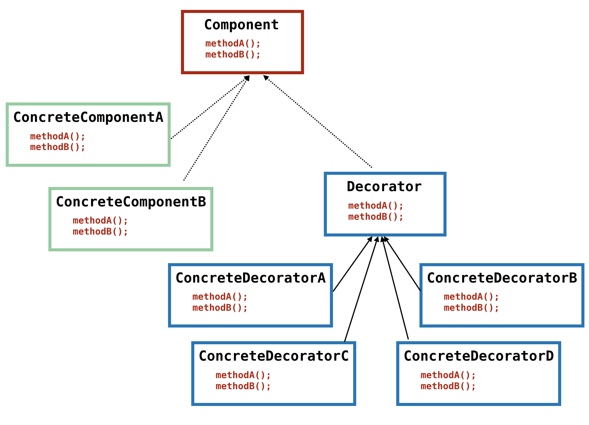
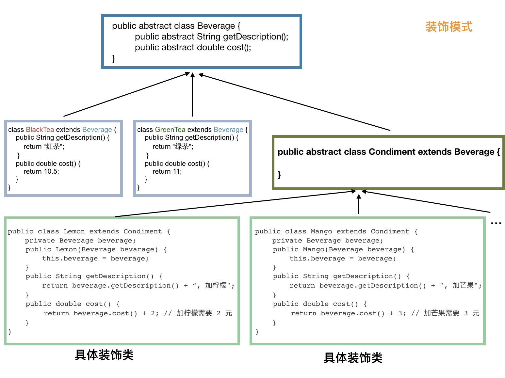
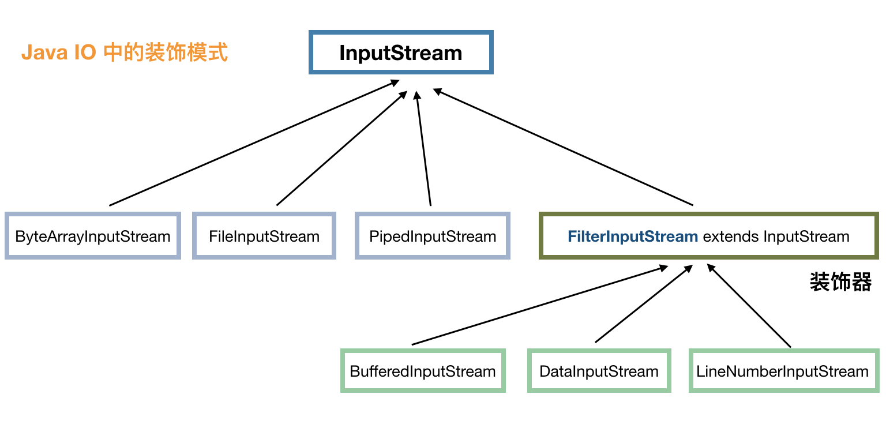

### 装饰模式

要把装饰模式说清楚明白，不是件容易的事情。也许读者知道 Java IO 中的几个类是典型的装饰模式的应用，但是读者不一定清楚其中的关系，也许看完就忘了，希望看完这节后，读者可以对其有更深的感悟。

首先，我们先看一个简单的图，看这个图的时候，了解下层次结构就可以了：



我们来说说装饰模式的出发点，从图中可以看到，接口 `Component` 其实已经有了 `ConcreteComponentA` 和 `ConcreteComponentB` 两个实现类了，但是，如果我们要**增强**这两个实现类的话，我们就可以采用装饰模式，用具体的装饰器来**装饰**实现类，以达到增强的目的。

> 从名字来简单解释下装饰器。既然说是装饰，那么往往就是**添加小功能**这种，而且，我们要满足可以添加多个小功能。最简单的，代理模式就可以实现功能的增强，但是代理不容易实现多个功能的增强，当然你可以说用代理包装代理的方式，但是那样的话代码就复杂了。

首先明白一些简单的概念，从图中我们看到，所有的具体装饰者们 ConcreteDecorator *都可以作为 Component 来使用，因为它们都实现了 Component 中的所有接口。它们和 Component 实现类 ConcreteComponent* 的区别是，它们只是装饰者，起**装饰**作用，也就是即使它们看上去牛逼轰轰，但是它们都只是在具体的实现中**加了层皮来装饰**而已。

> 注意这段话中混杂在各个名词中的 Component 和 Decorator，别搞混了。

下面来看看一个例子，先把装饰模式弄清楚，然后再介绍下 java io 中的装饰模式的应用。

最近大街上流行起来了“快乐柠檬”，我们把快乐柠檬的饮料分为三类：红茶、绿茶、咖啡，在这三大类的基础上，又增加了许多的口味，什么金桔柠檬红茶、金桔柠檬珍珠绿茶、芒果红茶、芒果绿茶、芒果珍珠红茶、烤珍珠红茶、烤珍珠芒果绿茶、椰香胚芽咖啡、焦糖可可咖啡等等，每家店都有很长的菜单，但是仔细看下，其实原料也没几样，但是可以搭配出很多组合，如果顾客需要，很多没出现在菜单中的饮料他们也是可以做的。

在这个例子中，红茶、绿茶、咖啡是最基础的饮料，其他的像金桔柠檬、芒果、珍珠、椰果、焦糖等都属于装饰用的。当然，在开发中，我们确实可以像门店一样，开发这些类：LemonBlackTea、LemonGreenTea、MangoBlackTea、MangoLemonGreenTea......但是，很快我们就发现，这样子干肯定是不行的，这会导致我们需要组合出所有的可能，而且如果客人需要在红茶中加双份柠檬怎么办？三份柠檬怎么办？万一有个变态要四份柠檬，所以这种做法是给自己找加班的。

不说废话了，上代码。

首先，定义饮料抽象基类：

```java
public abstract class Beverage {
      // 返回描述
      public abstract String getDescription();
      // 返回价格
      public abstract double cost();
}
```

然后是三个基础饮料实现类，红茶、绿茶和咖啡：

```java
public class BlackTea extends Beverage {
      public String getDescription() {
        return "红茶";
    }
      public double cost() {
        return 10;
    }
}
public class GreenTea extends Beverage {
    public String getDescription() {
        return "绿茶";
    }
      public double cost() {
        return 11;
    }
}
...// 咖啡省略
```

定义调料，也就是装饰者的基类，此类必须继承自 Beverage：

```java
// 调料
public abstract class Condiment extends Beverage {

}
```

然后我们来定义柠檬、芒果等具体的调料，它们属于装饰者，毫无疑问，这些调料肯定都需要继承 Condiment 类：

```java
public class Lemon extends Condiment {
    private Beverage bevarage;
      // 这里很关键，需要传入具体的饮料，如需要传入没有被装饰的红茶或绿茶，
      // 当然也可以传入已经装饰好的芒果绿茶，这样可以做芒果柠檬绿茶
      public Lemon(Beverage bevarage) {
        this.bevarage = bevarage;
    }
      public String getDescription() {
        // 装饰
        return bevarage.getDescription() + ", 加柠檬";
    }
      public double cost() {
          // 装饰
        return beverage.cost() + 2; // 加柠檬需要 2 元
    }
}
public class Mango extends Condiment {
    private Beverage bevarage;
      public Mango(Beverage bevarage) {
        this.bevarage = bevarage;
    }
      public String getDescription() {
        return bevarage.getDescription() + ", 加芒果";
    }
      public double cost() {
        return beverage.cost() + 3; // 加芒果需要 3 元
    }
}
...// 给每一种调料都加一个类
```

看客户端调用：

```java
public static void main(String[] args) {
      // 首先，我们需要一个基础饮料，红茶、绿茶或咖啡
    Beverage beverage = new GreenTea();
      // 开始装饰
      beverage = new Lemon(beverage); // 先加一份柠檬
      beverage = new Mongo(beverage); // 再加一份芒果

      System.out.println(beverage.getDescription() + " 价格：￥" + beverage.cost());
      //"绿茶, 加柠檬, 加芒果 价格：￥16"
}
```

如果我们需要芒果珍珠双份柠檬红茶：

```java
Beverage beverage = new Mongo(new Pearl(new Lemon(new Lemon(new BlackTea()))));
```

是不是很变态？

看看下图可能会清晰一些：



到这里，大家应该已经清楚装饰模式了吧。

下面，我们再来说说 java IO 中的装饰模式。看下图 InputStream 派生出来的部分类：



我们知道 InputStream 代表了输入流，具体的输入来源可以是文件（FileInputStream）、管道（PipedInputStream）、数组（ByteArrayInputStream）等，这些就像前面奶茶的例子中的红茶、绿茶，属于基础输入流。

FilterInputStream 承接了装饰模式的关键节点，其实现类是一系列装饰器，比如 BufferedInputStream 代表用缓冲来装饰，也就使得输入流具有了缓冲的功能，LineNumberInputStream 代表用行号来装饰，在操作的时候就可以取得行号了，DataInputStream 的装饰，使得我们可以从输入流转换为 java 中的基本类型值。

当然，在 java IO 中，如果我们使用装饰器的话，就不太适合面向接口编程了，如：

```java
InputStream inputStream = new LineNumberInputStream(new BufferedInputStream(new FileInputStream("")));
```

这样的结果是，InputStream 还是不具有读取行号的功能，因为读取行号的方法定义在 LineNumberInputStream 类中。

我们应该像下面这样使用：

```java
DataInputStream is = new DataInputStream(
                              new BufferedInputStream(
                                  new FileInputStream("")));
```

> 所以说嘛，要找到纯的严格符合设计模式的代码还是比较难的。